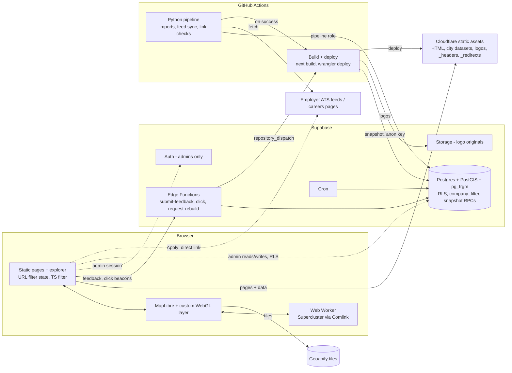

# Architecture

This is a summary. The full rationale is in the [architecture plan](../Company%20Map%20—%20Architecture%20&%20Implementation%20Plan.md). Hosting follows **[ADR-0006](decisions/0006-free-tier-static-hosting.md)** and **[ADR-0007](decisions/0007-workers-static-assets.md)** (30 Sep 2026): free tiers only, a static site served as Cloudflare Workers static assets (Cloudflare's successor to Pages), and the backend in Supabase. It replaces the plan's Workers + OpenNext design.

## Components
| Component | Technology | Responsibility |
| --- | --- | --- |
| Web app | Next.js App Router, **static export** (`output: "export"`), served as **Cloudflare Workers static assets** (assets-only Worker, Free) | Prerendered public pages, the explorer (client-side), and the admin workspace (client-rendered). No server code |
| Map client | MapLibre GL JS + custom WebGL layer; Supercluster in a Web Worker (Comlink) | Rendering, clustering, animation, hit testing ([map-spec.md](map-spec.md), unchanged) |
| Explorer data | Static per-city dataset written at build: company summaries, office points, and a lazily loaded search index | Map, Grid, List, and counts, all filtered by one TypeScript mirror of `company_filter` |
| Build + deploy | GitHub Actions: `next build` reads a Supabase snapshot (anon key), then `wrangler deploy` (`--env staging` for staging) | Company pages, datasets, logo atlas, `sitemap.xml`, `_redirects` |
| Database | Supabase Postgres + PostGIS + `pg_trgm` + FTS | Data, `company_filter` + snapshot RPCs, RLS |
| Auth | Supabase Auth | **Administrators only**, with an allowlist in `admin_user`. RLS is the only enforcement |
| Server-side functions | Supabase Edge Functions | `submit-feedback` (Turnstile + Zod + rate limit), `click` (outbound-click counter), `request-rebuild` (reviewer+ → GitHub `repository_dispatch`), and the report re-check |
| Files | Supabase Storage (source of truth for logos) | The build copies logos into the static site and map atlas pages, so visitors never download from Supabase |
| Light schedules | Supabase Cron | Stale-job sweep, count refresh, run heartbeats |
| Batch jobs | Python in GitHub Actions | Imports, feed sync, link checks, geocoding, then a site rebuild trigger |
| Basemap | Geoapify vector tiles (free fallback: Protomaps PMTiles) | Tiles and style, with attribution |
| Edge protection | Turnstile + per-function rate limits in Supabase; static-asset `_headers` for CSP and security headers | Public forms, outbound beacons |

## Data flow

## Hosting and environments
- **Cloudflare assets-only Workers** (Free):
  - Production is Worker `company-map`, not deployed yet. A custom domain needs the domain's DNS on Cloudflare (D-08).
  - Staging is Worker `company-map-staging` at https://company-map-staging.company-map.workers.dev. It's `noindex` and will be built against the staging Supabase project.
  - Every production deploy needs explicit authorization.
- **Supabase projects** (Free allows 2 active): `staging` and `prod`, in the Mumbai region. Development uses the local stack (`supabase start`).
- **Freshness:** the site rebuilds after each successful pipeline run, on admin **Publish now** (debounced), and nightly. The time from a data change to live is one build plus deploy (measured in P1-06/P8-05).
- The P1-02 Workers preview (`company-map-preview`) is a feasibility artefact. It can be deleted once Pages staging works.

## Free-tier limits the design depends on
Checked 30 Sep 2026; full table in [ADR-0006](decisions/0006-free-tier-static-hosting.md#free-tier-validation-limits-checked-on-the-providers-pages-30-sep-2026).
- **Workers static assets:** requests free and unlimited; 20,000 files per version; 25 MiB per file; 2,000 static + 100 dynamic redirects; 100 header rules. The build guards all of these. Each prerendered page is 5 files (ADR-0007).
- **Supabase:** 500 MB database, 5 GB egress, 500,000 Edge Function invocations/month, 2 active projects, and projects pause after a week of inactivity. The public site keeps working if a project pauses.
- **GitHub Actions** is free on standard runners while the repository is public.

## Stack guardrails
No FastAPI, Celery, Redis, AWS, or Kubernetes, and no paid plans. Any new service needs an ADR with a concrete requirement and the owner's approval.
