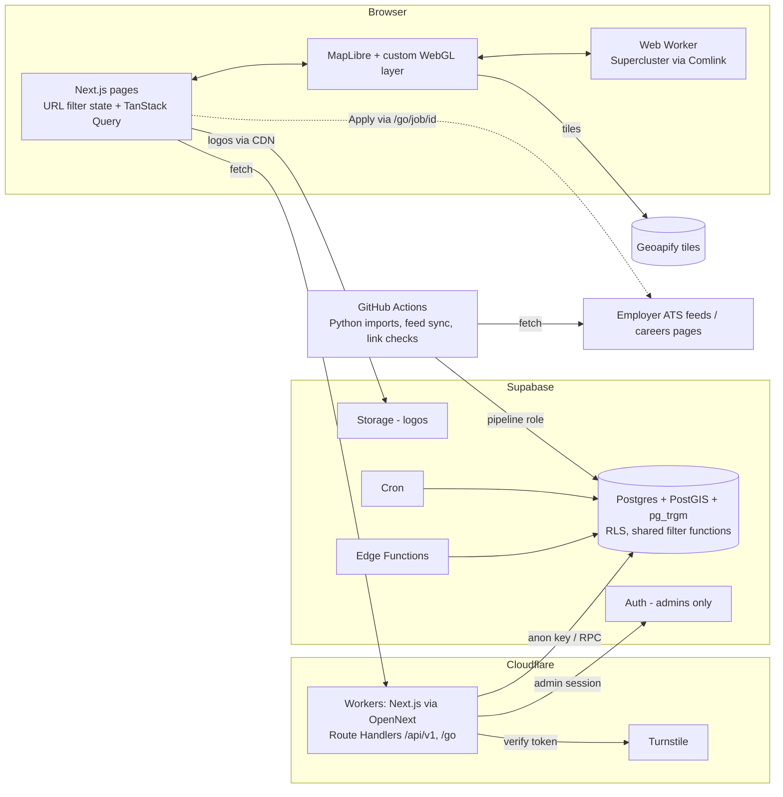

# Architecture

This is a summary. The full rationale is in the [architecture plan](../Company%20Map%20—%20Architecture%20&%20Implementation%20Plan.md). Hosting-tier assumptions are still open ([ADR-0003](decisions/0003-hosting-plan-tiers.md)).

## Components
| Component | Technology | Responsibility |
| --- | --- | --- |
| Web app | Next.js App Router on Cloudflare Workers (`@opennextjs/cloudflare`, Node.js runtime, not Edge runtime) | Public pages (SSR), explorer, admin workspace, API |
| Map client | MapLibre GL JS + custom WebGL layer; Supercluster in a Web Worker (Comlink) | Rendering, clustering, animation, hit testing |
| API | Route Handlers `app/api/v1/*`, `app/go/*` | Zod validation, cache headers, Turnstile verification, calls Postgres RPCs through `supabase-js` |
| Database | Supabase Postgres + PostGIS + `pg_trgm` + FTS | Data, the shared filter/search functions, RLS |
| Auth | Supabase Auth | **Administrators only**, with an allowlist in `admin_user` |
| Files | Supabase Storage (served through the Cloudflare cache) | Logos, city artwork |
| Event tasks | Supabase Edge Functions | Instant re-check when a job is reported; cache purge on publish |
| Light schedules | Supabase Cron | Stale-job sweep, count refresh, run heartbeats |
| Batch jobs | Python in GitHub Actions | Imports, feed sync, link checks, geocoding |
| Basemap | Geoapify vector tiles (later: Protomaps PMTiles on R2) | Tiles and style, with attribution |
| Edge protection | Cloudflare WAF rate rules, Turnstile | Public forms |

## Data flow

## Hosting and environments
- Supabase projects: `dev`, `staging`, `prod` (Mumbai region, per the plan). Cloudflare: preview, staging, and production Workers. Every production deploy needs explicit authorization.
- The explorer fetches the whole filtered city point set, a compact payload (the plan estimates under 100 KB gzipped for about 1,500 offices), and clusters it on the client. Server-side clustering is held back for datasets above about 50k points.
- Caching: API reads get edge cache headers keyed by `city.data_version` + filter hash. An OpenNext incremental cache (R2) is needed **only if** ISR or the data cache is used (OpenNext docs, checked 30 Sep 2026).

## Stack guardrails
No FastAPI, Celery, Redis, AWS, or Kubernetes. Any new service needs an ADR with a concrete requirement.
