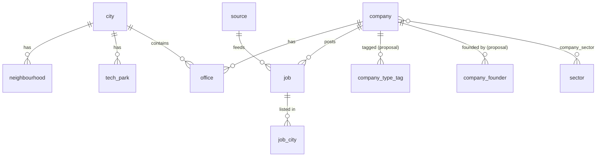

# Data Model

The base schema comes from the [architecture plan](../Company%20Map%20—%20Architecture%20&%20Implementation%20Plan.md#database) (its core DDL is authoritative for the tables it defines). This file records the **changes needed** to meet the confirmed brief. Each change is marked **[Proposal]** until the related decision is closed.

## Entities (from the plan)

`city` · `neighbourhood` · `tech_park` · `company` · `sector` / `company_sector` · `office` · `job` · `job_city` · `source` · `verification_check` (partitioned by month) · `submission` · `admin_user` · `audit_log` · `slug_redirect` · `import_batch`.



## Changes against the plan

### 1. Company types overlap [Proposal, D-02]
The plan's single `company.company_type` column can't represent a company that is both a Startup and a Product company. Proposed replacement:

```sql
CREATE TYPE company_type AS ENUM ('startup','mnc','product');   -- launch set; extend by migration
CREATE TABLE company_type_tag (
  company_id uuid REFERENCES company(id) ON DELETE CASCADE,
  type       company_type NOT NULL,
  PRIMARY KEY (company_id, type)
);
```
- The filter is OR within the group: `type IN (...)` via `EXISTS`, and results are always `DISTINCT company`.
- The plan's extra values (`services`, `gcc`, `other`) aren't in the launch filter. Whether to keep them as non-filterable tags is part of D-02.
- The definition of "Product" (the company builds its own product, as opposed to services) must be written into the curation guide.

### 2. Startup stage [Proposal, D-05]
```sql
CREATE TYPE startup_stage AS ENUM
  ('pre_seed','seed','bootstrapped','series_a','series_b','series_c','series_c_plus','public','acquired');
ALTER TABLE company ADD COLUMN startup_stage startup_stage;  -- NULL = unknown, never guessed
-- CHECK via trigger: startup_stage IS NULL OR company has 'startup' tag
```
- The stage filter applies only when `startup` is in the type filter. The server **ignores** stage parameters without `type=startup`, and the client normalises the URL to match.
- Open question D-05: "Bootstrapped" is a funding mode, and "Public" and "Acquired" are outcomes rather than stages. They're kept in one list because the brief asks for it.

### 3. Founder name search [Proposal, D-03]
The plan has no founder data. Proposed:
```sql
CREATE TABLE company_founder (
  id          uuid PRIMARY KEY DEFAULT gen_random_uuid(),
  company_id  uuid NOT NULL REFERENCES company(id) ON DELETE CASCADE,
  full_name   text NOT NULL,
  source_url  text NOT NULL,          -- where this was published by the company
  status      text NOT NULL DEFAULT 'draft' CHECK (status IN ('draft','published'))
);
CREATE INDEX company_founder_name_trgm ON company_founder USING gin (full_name gin_trgm_ops);
```
Only founders the company itself publishes (on its website or in a press kit) are stored, and only after admin review. Founder names are included in `company.search_doc`. Removal requests go through the feedback process.

### 4. Search scope [Confirmed brief]
One search input matches: **job title** (`job.title_norm`, trigram + role family), **company name** (FTS + trigram), **location** (neighbourhood, tech park, office address locality), and **founder name**. Suggest results are grouped by kind.

## Indexes (plan plus additions)
- GIN on `company.search_doc` and trigram on `company.name`, `job.title_norm`, and `company_founder.full_name`.
- GiST on `office.geom`. Partial index `office (city_id) WHERE status='published'`.
- `job (company_id) WHERE status IN ('active','suspect')`.
- [Proposal] `company_type_tag (type, company_id)` and `company (startup_stage) WHERE startup_stage IS NOT NULL`.

## Shared filter function
`company_filter(city_slug, filters jsonb) RETURNS SETOF uuid` is the **reference definition** of filter semantics. The functions are `STABLE` and `SECURITY INVOKER`, so RLS still applies.

Since ADR-0006 the explorer runs in the browser over a static dataset. `city_build_snapshot(city_slug)` (anon, published rows only) returns everything the build needs in one call: company summaries, offices, types, stages, job titles, founders, `last_checked_at`, and slug redirects. `lib/filters/` holds the **single TypeScript mirror** of `company_filter`, used by Map, Grid, List, and all counts. A CI parity test runs both over the filter matrix and requires identical company-ID sets. Aggregated outbound clicks go to `link_click_daily(day, kind, target_id, count)`, incremented only by the `click` Edge Function, with no visitor data.

## Authorization rules
| Role | company / office / founder | job | submission | admin tables |
| --- | --- | --- | --- | --- |
| `anon` | SELECT where `status='published'` | SELECT where `status IN ('active','suspect')` and the company is published | none directly (INSERT only through the `submit-feedback` Edge Function after Turnstile) | none |
| `authenticated`, not in `admin_user` | same as anon | same as anon | none | none |
| admin `editor` | full CRUD, cannot delete published records | CRUD | read | none |
| admin `reviewer` | editor + publish | + publish | resolve | read audit_log |
| admin `admin` | all | all | all | manage `admin_user` |
| pipeline (dedicated Postgres role, server-side only) | upsert via functions | upsert and status changes | none | writes `verification_check`, `import_batch` |

RLS is enabled on **every** table in `public`. `is_admin()` is `SECURITY DEFINER` with a fixed `search_path` (see the plan's DDL). Every policy has a pgTAP test.

Open question: the plan's public policy exposes `suspect` jobs. Confirm that suspect jobs stay visible until the second failed check.
